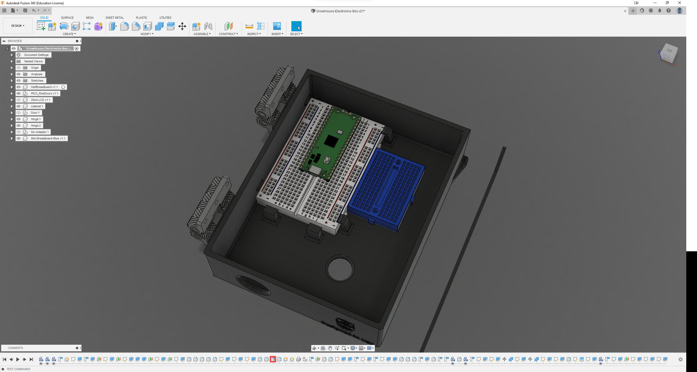

##  GrowHouse

This is a growhouse project that will be used as an indoor herb garden as well as starting seedlings in the spring. It is constructed using 1" EPS foam board with a silver foil liner on one side.

- Internal Dimensions: 32"x20"x20".

