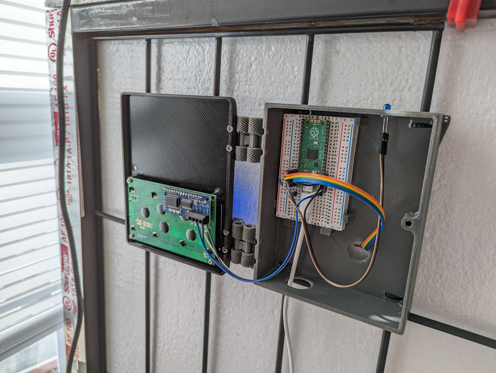
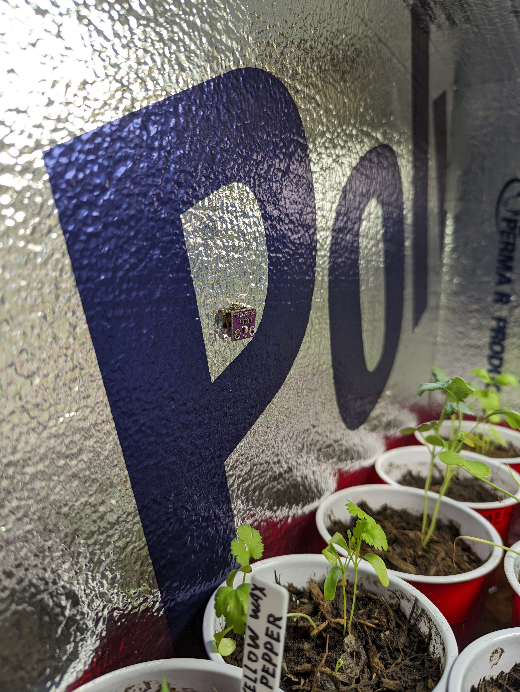

##  GrowHouse

This is a growhouse project that will be used as an indoor herb garden as well as starting seedlings in the spring. It is constructed using 1" EPS foam board with a silver foil liner on one side with internal Dimensions of: 32"x20"x20".

Closed:

CAD View:

Open:

Placement of probe:
